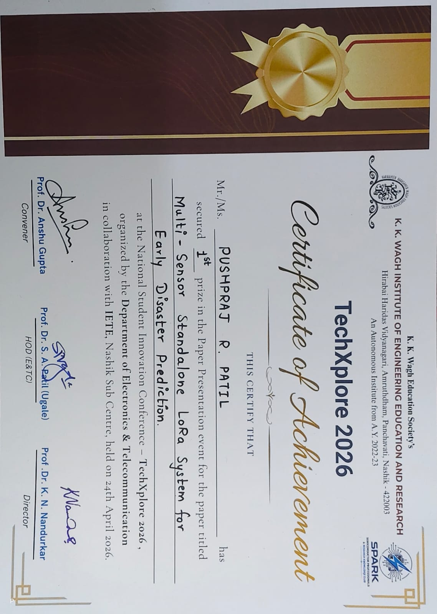
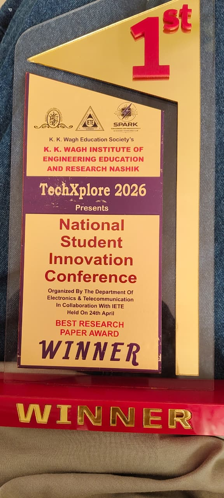

# Title - LoRa Based Weather Monitoring System

## Overview
This project is a long-range weather monitoring system using LoRa communication.

## Objective
To monitor environmental parameters remotely using low-power long-range communication.

## Components Used
- Transmitter Node - ESP32 Dev Board
- Receiver Node - ESP8266 Dev Board
- LoRa Module (SX1278) x2
- MQ - 2 Gas Sensor, DHT22 Temperature Sensor, Flame Sensor, Rain Sensor, LDR Sensor Module
- Antenna x2

## Working Principle
Sensor data is collected and transmitted using LoRa module to a receiver node.
The receiver displays data on serial monitor.

## Technologies Used
- Embedded C / Arduino IDE
- LoRa Communication
- IoT Basics

## Research Paper Recognition
The research paper based on this project won **First Prize** at the **TechXplore 2026 National Student Innovation Conference** organized by K. K. Wagh Institute of Engineering Education & Research, Nashik.

### Certificate

### Trophy

